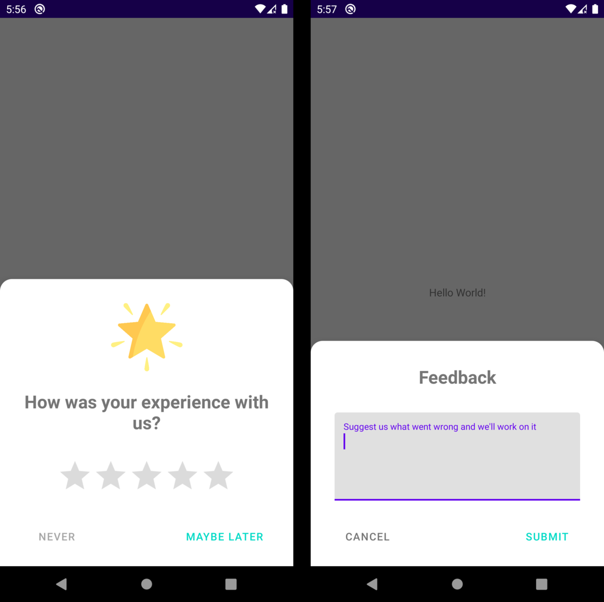

# Smart Rate

[Smart rate](https://github.com/RankoR/android-smart-rate) is a library that helps you improve your app's rating and get user feedback, inspired by [Smart App Rate](https://github.com/codemybrainsout/smart-app-rate) library.

## Features

- Auto-fetch app icon to display it in the dialog
- Appears after the specified session count
- Redirects to app store (see below), if the given rating is greater then minimal value, specified by you
- Shows feedback form (with callback to your code), if rating is below then specified
- Supports multiple app stores:
  - Google Play
  - Amazon
  - Xiaomi (currently link is duplicate of Google Play)
  - Samsung
  - Aptoide (temporary disabled)
  - Custom link
- Prompts for rating later after given amount of sessions (if user clicked «Later»)
- Customizable texts (all!). Two default translations provided — English and Russian.
- Customizable text and buttons colors

## Installation

## Set up

 
